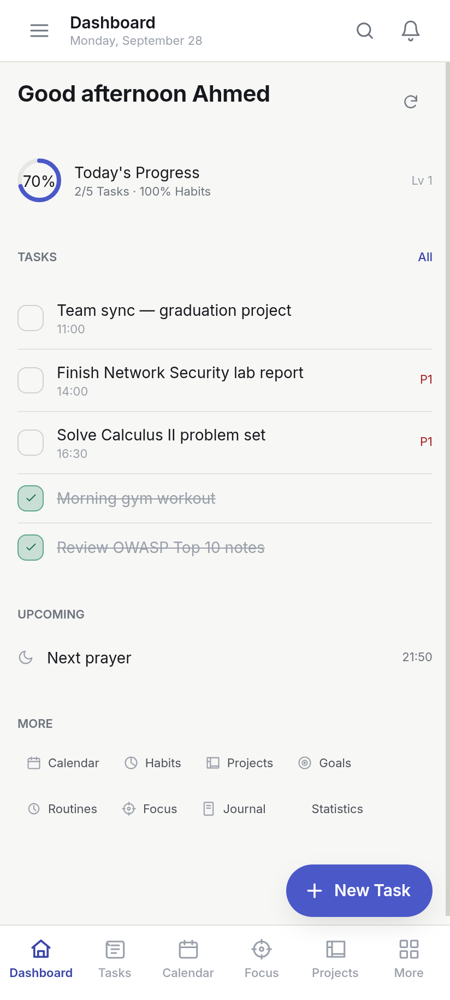
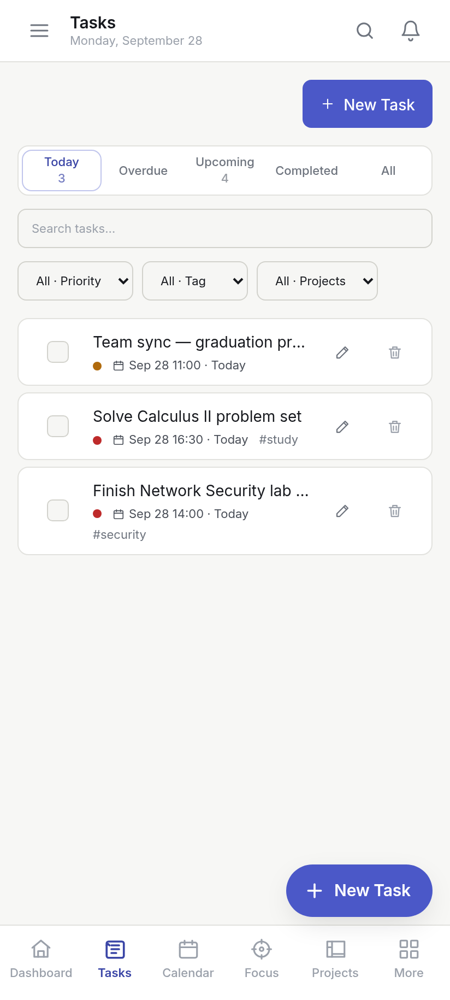
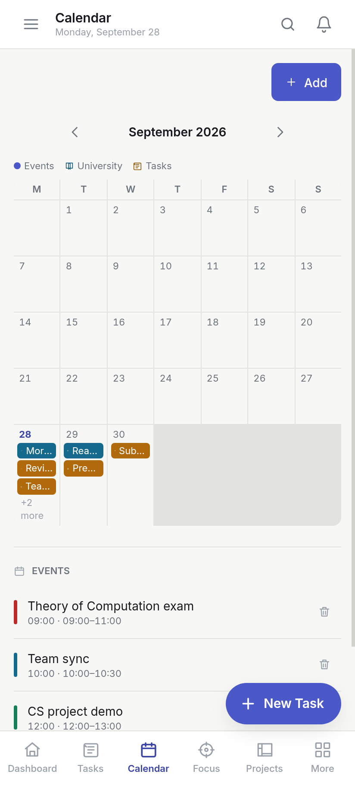
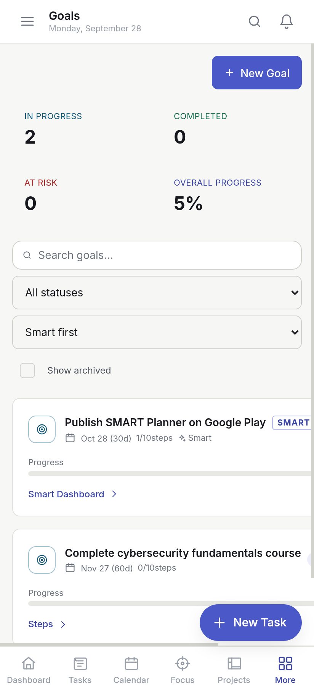
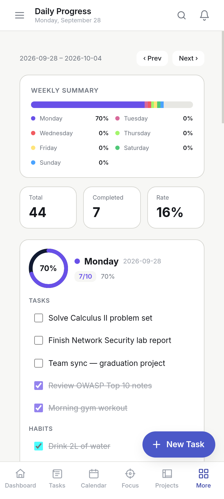
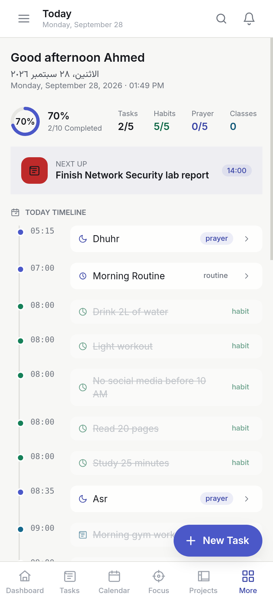
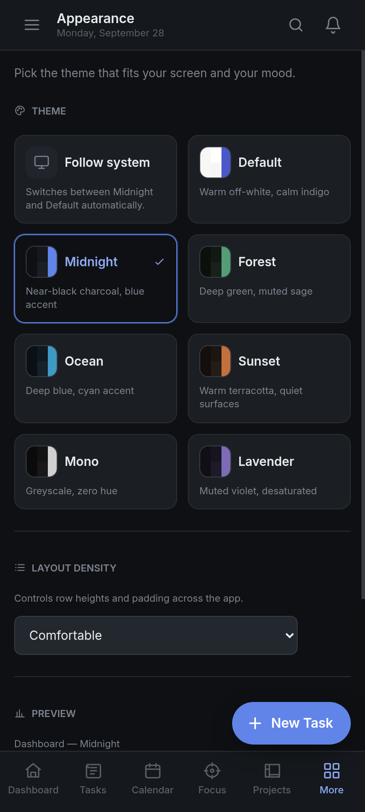
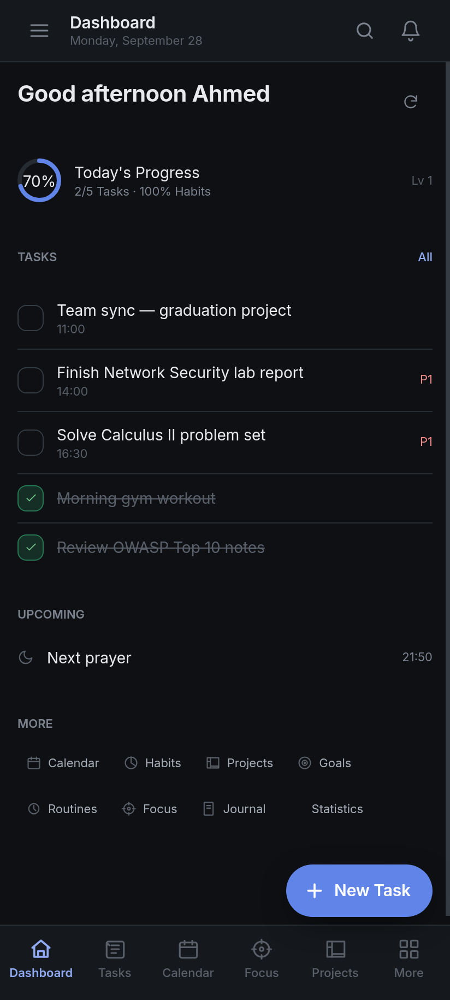

# SMART Planner — بنِ يومك، وابنِ نفسك

An offline-first productivity app: tasks, habits, goals, projects, routines,
focus sessions, mood, journal, notes, calendar, inbox, achievements and
analytics — all in one place, from one shared React codebase.

Ships as an **Android app** (Capacitor) and a **Windows / Linux / macOS desktop
app** (Electron), fully bilingual (English LTR + Arabic RTL).

No account. No cloud. No ads. Your data stays on your device.

---

## Screenshots

### Default (light)

| Dashboard | Tasks | Calendar |
|---|---|---|
|  |  |  |

| Goals | Daily progress | Today |
|---|---|---|
|  |  |  |

### Midnight theme

| Appearance & themes | Dashboard in dark |
|---|---|
|  |  |

---

## Features

- **Tasks** — priorities, due dates, recurring schedules, search and filtering.
- **Habits** — build streaks with today/calendar consistency tracking.
- **Goals** — break big goals into measurable steps (SMART-style planning).
- **Projects & routines** — structured work and repeatable daily/weekly blocks.
- **Focus sessions** — timers plus analytics: daily progress, monthly goals,
  focus distribution and streaks.
- **Today view** — your day at a glance, with an optional Islamic (Hijri) date
  shown in the Arabic locale.
- **Calendar & inbox** — plan events and capture thoughts instantly.
- **Mood, journal, notes, achievements** — track the rest of your life too.
- **Notifications** — local scheduling, no external services.
- **7 themes + system** — `default`, `midnight`, `forest`, `ocean`, `sunset`,
  `mono`, `lavender`, each a pure design-token swap.
- **Tailored mobile experience** — immersive edge-to-edge UI, predictive-back
  navigation and a proper back stack that closes dialogs before leaving the app.

## Tech stack

| Layer | Technology |
|---|---|
| UI | React 18, TypeScript 5.5, Vite 5 |
| Styling | Tailwind CSS 3 + semantic CSS-variable design tokens |
| State | Zustand |
| i18n | i18next / react-i18next (English, Arabic) |
| Charts | Recharts |
| Icons | lucide-react |
| Mobile shell | Capacitor 8 (Android + iOS) |
| Desktop shell | Electron 31 |
| Desktop DB | better-sqlite3 (WAL, foreign keys) |
| Mobile DB | IndexedDB via `mobile/shim.js` |
| Tests | Vitest |

## Platforms

- **Android** — Capacitor native project (source committed under `android/`).
- **Desktop** — Electron for Windows / Linux / macOS (`better-sqlite3`).
- **Web** — the renderer runs in a plain browser for local development.

## Getting started

```bash
npm install

npm run dev            # Electron + Vite dev server
npm run dev:web        # renderer only, in the browser
npm run build          # typecheck + renderer + electron main
npm start              # run the built desktop app
npm test               # run the test suite
```

## Android build

```bash
npm run build:android   # build:mobile -> cap sync -> gradle assembleDebug
```

Produces:

```
android/app/build/outputs/apk/debug/app-debug.apk
```

`build:android` runs three steps:

1. `build:mobile` — Vite build, then copies `mobile/shim.js` into `dist/` and
   injects it into `dist/index.html`.
2. `cap:sync` — copies the web build into the native projects.
3. `android:gradle` — `assembleDebug` via the Gradle wrapper.

Requires a JDK and the Android SDK (defaults to `~/jdk/current` and
`~/android-sdk`; override with `JAVA_HOME` / `ANDROID_HOME`).

### Release signing

Release signing reads credentials from `android/app/keystore.properties`, which
is **git-ignored along with `*.jks` / `*.keystore`**. Without that file the
release build type simply skips signing, so debug builds and CI work without
secrets present.

To set up signing, create the file locally:

```properties
storeFile=keystore/your-release.jks
storePassword=...
keyAlias=...
keyPassword=...
```

**Never commit the keystore or its passwords.** A leaked release key lets
anyone ship an update the Play Store accepts as this app.

## Architecture

```
electron/           # desktop main process
  db/               # connection, schema (migrate + seed)
  engines/          # business logic, shared by desktop and tests
  ipc.ts            # IPC channel registration
mobile/
  shim.js           # same API surface over IndexedDB, for Capacitor/web
src/                # React renderer
  components/       # layout + UI primitives
  i18n/             # en.ts, ar.ts
  lib/              # api.ts, data.ts, app.ts, back.ts
  pages/            # page components, code-split via React.lazy
  store/            # zustand stores
  styles/           # tokens.css — semantic theme variables
android/            # Capacitor Android project
ios/                # Capacitor iOS project
scripts/
tests/              # Vitest suites
```

The renderer never touches storage directly — it talks to `window.ahmedAPI`
(`src/lib/api.ts`), which the Electron preload or the mobile shim provides. The
data layer (`electron/engines/*`, `electron/db/*`, `mobile/shim.js`) is shared
across every platform.

On Android the app uses immersive edge-to-edge rendering, hides the system bars,
and re-applies that on window focus. Back navigation resolves in priority order:
topmost overlay → route history → `moveTaskToBack()`, and the manifest enables
Android 13+ predictive-back through the `OnBackInvokedDispatcher`.

## Theming

Semantic tokens in `src/styles/tokens.css` drive every component — no literal
colors in UI code. Theme changes are pure token swaps, and native chrome is
re-synced when the active theme changes. The shell's app bar is the single
source of a page title, so views never duplicate their own heading.

## Data

- Desktop: `~/.ahmed-kilwa/ahmed-kilwa.db` (override with
  `AHMED_KILWA_DATA_DIR`).
- Android/Web: the device's private WebView storage (IndexedDB). Uninstalling
  the app removes it.

---

## License

Proprietary. All rights reserved. No license is granted for reuse.